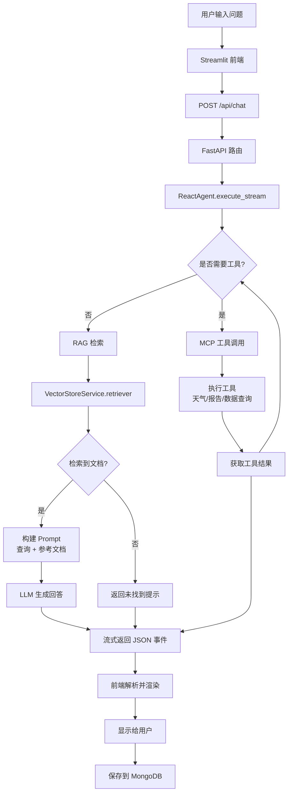
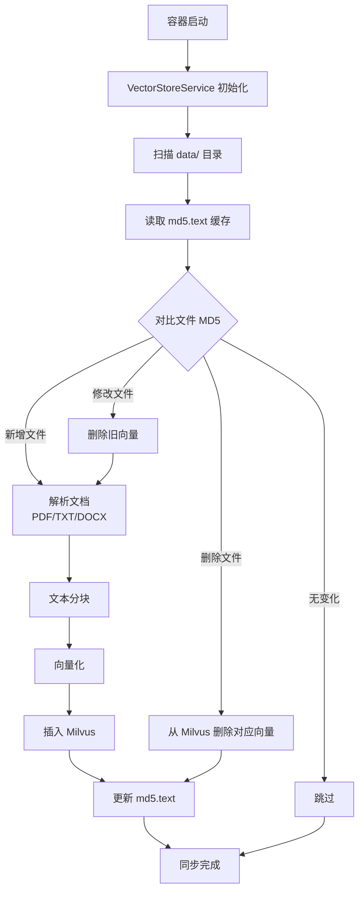
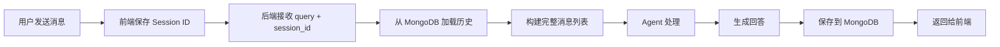

# 智能问答 Agent - 项目架构文档

## 📋 目录

- [1. 系统概述](#1-系统概述)
- [2. 技术架构](#2-技术架构)
- [3. 模块设计](#3-模块设计)
- [4. 数据流设计](#4-数据流设计)
- [5. 部署架构](#5-部署架构)
- [6. 核心流程](#6-核心流程)
- [7. 关键技术决策](#7-关键技术决策)

---

## 1. 系统概述

### 1.1 项目定位

基于 **RAG (检索增强生成)** 和 **ReAct Agent** 架构的智能问答系统，专注于扫地机器人领域的知识库问答服务。

### 1.2 核心能力

| 能力维度 | 说明 |
|---------|------|
| **智能检索** | BM25 + 向量相似度 + Rerank 重排序的混合检索策略 |
| **工具调用** | 基于 MCP 协议的工具调用（天气查询、报告生成等） |
| **多轮对话** | MongoDB 持久化存储聊天历史，支持上下文记忆 |
| **自动同步** | 文件增删改自动同步至 Milvus 向量库 |
| **多模型支持** | 兼容 Ollama 本地模型与阿里云 API |

### 1.3 应用场景

- 产品选购咨询（根据户型、预算推荐机型）
- 故障诊断与排除（基于故障现象提供解决方案）
- 维护保养指导（清洁周期、耗材更换提醒）
- 使用技巧分享（高级功能使用方法）

---

## 2. 技术架构

### 2.1 整体架构图

```
┌─────────────────────────────────────────────────────────────┐
│                        用户交互层                              │
│  ┌──────────────┐                                           │
│  │  Streamlit   │ ← HTTP/WebSocket → 浏览器访问              │
│  │  Frontend    │   (端口: 8501)                             │
│  └──────────────┘                                           │
└────────────────────────┬────────────────────────────────────┘
                         │
┌────────────────────────▼────────────────────────────────────┐
│                        API 网关层                             │
│  ┌──────────────────────────────────────────────┐           │
│  │              FastAPI Backend                  │           │
│  │  • CORS 中间件                                │           │
│  │  • 路由分发 (/api/chat, /health)             │           │
│  │  • 请求/响应序列化                            │           │
│  └──────────────────────────────────────────────┘           │
│                     (端口: 8000)                              │
└────────────────────────┬────────────────────────────────────┘
                         │
┌────────────────────────▼────────────────────────────────────┐
│                      业务逻辑层                               │
│                                                             │
│  ┌─────────────────────┐   ┌────────────────────────────┐  │
│  │   ReAct Agent       │   │   RAG Service              │  │
│  │                     │   │                            │  │
│  │ • LangGraph State   │   │ • VectorStoreService       │  │
│  │ • Tool Orchestration│   │ • Hybrid Retriever         │  │
│  │ • Stream Response   │   │ • RagSummarizeService      │  │
│  └─────────────────────┘   └────────────────────────────┘  │
│                                                             │
│  ┌────────────────────────────────────────────────────┐    │
│  │              MCP Tools Layer                       │    │
│  │  • 天气查询工具 (高德地图 API)                      │    │
│  │  • 报告生成工具                                     │    │
│  │  • 外部数据查询工具                                 │    │
│  └────────────────────────────────────────────────────┘    │
└────────────────────────┬────────────────────────────────────┘
                         │
┌────────────────────────▼────────────────────────────────────┐
│                      数据存储层                               │
│                                                             │
│  ┌──────────────┐  ┌──────────────┐  ┌──────────────────┐  │
│  │   Milvus     │  │   MongoDB    │  │   File System    │  │
│  │  (向量数据库) │  │  (聊天历史)  │  │  (知识库文件)     │  │
│  │              │  │              │  │                  │  │
│  │ • Embeddings │  │ • Sessions   │  │ • PDF/TXT/DOCX   │  │
│  │ • Metadata   │  │ • Messages   │  │ • MD5 缓存       │  │
│  └──────────────┘  └──────────────┘  └──────────────────┘  │
└─────────────────────────────────────────────────────────────┘
                         │
┌────────────────────────▼────────────────────────────────────┐
│                      模型服务层                               │
│                                                             │
│  ┌──────────────────┐  ┌──────────────────────────────┐    │
│  │   Ollama         │  │   阿里云 DashScope           │    │
│  │  (本地部署)       │  │  (云端 API)                   │    │
│  │                  │  │                              │    │
│  │ • qwen2.5:7b     │  │ • Qwen-Max                   │    │
│  │ • qwen3-embedding│  │ • text-embedding-v3          │    │
│  └──────────────────┘  └──────────────────────────────┘    │
│                                                             │
│  ┌────────────────────────────────────────────────────┐    │
│  │   Rerank Model (BAAI-bge-reranker-v2-m3)           │    │
│  └────────────────────────────────────────────────────┘    │
└─────────────────────────────────────────────────────────────┘
```

### 2.2 技术栈详情

#### 后端框架
- **FastAPI** (v0.110+): 高性能异步 Web 框架
- **Uvicorn**: ASGI 服务器
- **Pydantic** (v2.0+): 数据验证与序列化

#### Agent 框架
- **LangGraph** (v0.2.76): 状态图编排引擎
- **LangChain** (v0.3.11): LLM 应用开发框架
- **MCP Protocol** (v1.1+): Model Context Protocol 工具调用标准

#### 向量数据库
- **Milvus** (v2.4.0): 分布式向量搜索引擎
- **pymilvus** (v2.4+): Python 客户端

#### 检索增强
- **BM25**: 传统关键词检索算法
- **Sentence Transformers**: 文本向量化
- **BGE-Reranker-v2-m3**: 跨语言重排序模型

#### 前端框架
- **Streamlit** (v1.30+): 快速构建数据应用 UI

#### 数据存储
- **MongoDB** (v7.0): 文档数据库（聊天历史）
- **PyMongo** (v4.6+): MongoDB Python 驱动

#### 文档处理
- **PyPDF** (v4.0+): PDF 解析
- **docx2txt** (v0.8+): Word 文档解析
- **LangChain Text Splitters**: 文本分块策略

---

## 3. 模块设计

### 3.1 项目目录结构

```
Agent/
├── agent/                    # Agent 核心模块
│   ├── __init__.py
│   ├── react_agent.py        # ReAct Agent 实现（流式响应、工具调用）
│   └── tools/                # MCP 工具集
│       ├── __init__.py
│       └── mcp_server.py     # 工具定义（天气、报告、数据查询）
│
├── api/                      # API 接口层
│   ├── __init__.py
│   ├── app.py                # FastAPI 应用入口
│   └── routes/               # 路由定义
│       ├── __init__.py
│       ├── chat.py           # 聊天接口 (/api/chat)
│       └── health.py         # 健康检查 (/health)
│
├── config/                   # 配置文件（YAML）
│   ├── agent.yml             # Agent 配置（外部数据路径、API Key）
│   ├── milvus.yml            # Milvus 配置（Collection、URI、检索参数）
│   ├── prompts.yml           # Prompt 模板配置
│   └── rag.yml               # RAG 配置（模型提供商、重排序参数）
│
├── data/                     # 知识库文件目录
│   ├── external/             # 外部数据（CSV 等）
│   ├── *.pdf                 # PDF 文档
│   ├── *.docx                # Word 文档
│   └── *.txt                 # 文本文件
│
├── frontend/                 # Streamlit 前端
│   ├── __init__.py
│   └── app.py                # 前端界面（聊天窗口、历史记录）
│
├── model/                    # 模型工厂
│   ├── __init__.py
│   └── factory.py            # ChatModel/EmbeddingModel 初始化
│
├── prompts/                  # Prompt 模板文件
│   ├── main_prompt.txt       # Agent 系统提示词
│   ├── rag_summarize.txt     # RAG 总结提示词
│   └── report_prompt.txt     # 报告生成提示词
│
├── rag/                      # RAG 服务模块
│   ├── __init__.py
│   ├── rag_service.py        # RAG 检索与总结服务
│   └── vector_store.py       # 向量存储与同步管理
│
├── utils/                    # 工具类
│   ├── __init__.py
│   ├── chat_history.py       # MongoDB 聊天历史管理
│   ├── config_handler.py     # YAML 配置加载器
│   ├── file_handler.py       # 文件读写工具
│   ├── logger_handler.py     # 日志配置
│   ├── path_tool.py          # 路径处理工具
│   └── prompt_loader.py      # Prompt 模板加载器
│
├── logs/                     # 日志文件目录
│   └── agent_YYYY-MM-DD.log  # 按日期分割的日志文件
│
├── tests/                    # 测试用例
│   └── test_rag_search.py    # RAG 检索测试
│
├── .env                      # 环境变量配置（不提交到 Git）
├── .env.example              # 环境变量模板
├── requirements.txt          # Python 依赖清单
├── docker-compose.yml        # Docker Compose 编排配置
├── Dockerfile.backend        # 后端镜像构建文件
├── Dockerfile.frontend       # 前端镜像构建文件
└── README.md                 # 项目说明文档
```

### 3.2 核心模块职责

#### 3.2.1 Agent 模块 (`agent/`)

**ReactAgent 类**
- **职责**: 协调工具调用与 LLM 推理，生成流式响应
- **关键方法**:
  - `execute_stream(query, history)`: 执行流式问答，返回 JSON 格式事件流
  - `_init_mcp_client()`: 初始化 MCP 客户端连接
- **工作流程**:
  1. 接收用户查询和历史消息
  2. 通过 MCP 客户端获取可用工具
  3. 创建 ReAct Agent（LangGraph）
  4. 流式执行并捕获中间步骤（工具调用、工具结果、最终回复）
  5. 以 JSON 事件流形式返回给前端

**MCP Tools**
- **天气查询工具**: 调用高德地图 API 获取实时天气
- **报告生成工具**: 基于用户历史生成个性化报告
- **外部数据查询**: 从 CSV 文件读取结构化数据

#### 3.2.2 RAG 模块 (`rag/`)

**VectorStoreService 类**
- **职责**: 管理 Milvus 向量库的连接、索引、检索
- **关键功能**:
  - 文档加载与分块（支持 PDF/TXT/DOCX）
  - 向量化存储（使用 Embedding 模型）
  - 混合检索（BM25 + 向量相似度）
  - Rerank 重排序（提升检索精度）
  - 文件同步（MD5 检测变更，自动更新向量数据）

**RagSummarizeService 类**
- **职责**: 基于检索结果生成自然语言回答
- **工作流程**:
  1. 接收用户查询
  2. 调用 VectorStoreService 检索相关文档
  3. 构建 Prompt（包含查询 + 参考文档）
  4. 调用 LLM 生成总结性回答

#### 3.2.3 API 模块 (`api/`)

**FastAPI 应用**
- **路由**:
  - `POST /api/chat`: 聊天接口（支持流式响应）
  - `GET /health`: 健康检查
- **中间件**:
  - CORS 跨域支持
  - 请求日志记录
- **依赖注入**:
  - ReactAgent 单例实例
  - 配置管理器

#### 3.2.4 模型工厂 (`model/`)

**ChatModelFactory 类**
- **职责**: 根据配置动态创建聊天模型实例
- **支持的提供商**:
  - **Ollama**: 本地部署模型（qwen2.5:7b）
  - **阿里云**: DashScope API（Qwen-Max）
- **特性**:
  - 每次请求创建新实例，避免事件循环冲突
  - 支持温度、最大 Token 等参数配置

**EmbeddingModel 初始化**
- **支持的提供商**:
  - **Ollama**: qwen3-embedding
  - **阿里云**: text-embedding-v3
- **用途**: 文档向量化、查询向量化

#### 3.2.5 工具模块 (`utils/`)

**ConfigHandler**: YAML 配置文件加载器，支持环境变量覆盖
**PromptLoader**: 从 `prompts/` 目录加载模板文件
**ChatHistoryManager**: MongoDB 聊天历史 CRUD 操作
**FileHandler**: 文件读写、MD5 计算
**LoggerHandler**: 日志配置（按日期分割、控制台 + 文件输出）

---

## 4. 数据流设计

### 4.1 用户提问流程



### 4.2 知识库同步流程



### 4.3 聊天历史管理流程



---

## 5. 部署架构

### 5.1 Docker Compose 部署

```yaml
services:
  backend:
    image: agent-backend
    ports: ["8000:8000"]
    volumes:
      - ./data:/app/data        # 知识库文件
      - ./logs:/app/logs        # 日志持久化
      - ./config:/app/config    # 配置文件
    environment:
      - MONGODB_URI=mongodb://host.docker.internal:27017
      - MILVUS_URI=http://host.docker.internal:19530
      - OLLAMA_BASE_URL=http://host.docker.internal:11434
  
  frontend:
    image: agent-frontend
    ports: ["8501:8501"]
    environment:
      - API_BASE_URL=http://backend:8000
    depends_on:
      backend:
        condition: service_healthy
```

### 5.2 网络拓扑

```
┌─────────────────────────────────────────────────┐
│                  Docker Network                  │
│              (agent-network)                     │
│                                                  │
│  ┌──────────────┐         ┌──────────────────┐  │
│  │   Frontend   │ ◄─────► │     Backend      │  │
│  │  (Streamlit) │  HTTP   │   (FastAPI)      │  │
│  │  Port: 8501  │         │   Port: 8000     │  │
│  └──────────────┘         └────────┬─────────┘  │
│                                    │             │
│                          host.docker.internal    │
└────────────────────────────────────┼─────────────┘
                                     │
                    ┌────────────────┼────────────────┐
                    ▼                ▼                ▼
              ┌──────────┐   ┌──────────┐   ┌──────────┐
              │ MongoDB  │   │  Milvus  │   │  Ollama  │
              │ Port:27017│   │Port:19530│   │Port:11434│
              └──────────┘   └──────────┘   └──────────┘
```

### 5.3 数据持久化策略

| 数据类型 | 存储位置 | 持久化方式 |
|---------|---------|-----------|
| 知识库文件 | `./data/` | Docker Volume 挂载 |
| 向量数据 | Milvus | Milvus 内部存储 |
| 聊天历史 | MongoDB | MongoDB 数据卷 |
| 日志文件 | `./logs/` | Docker Volume 挂载 |
| 配置文件 | `./config/` | Docker Volume 挂载 |
| MD5 缓存 | `/app/md5.text` | 容器内文件系统 |

---

## 6. 核心流程

### 6.1 ReAct Agent 执行流程

```
1. 接收用户查询
   ↓
2. 加载历史消息（从 MongoDB）
   ↓
3. 构建消息列表 [history + current_query]
   ↓
4. 创建 LangGraph ReAct Agent
   ├─ Model: ChatModelFactory.generator()
   ├─ Tools: MCP Client.get_tools()
   └─ State Modifier: system_prompt
   ↓
5. 流式执行 agent.astream(stream_mode="updates")
   ↓
6. 捕获中间步骤
   ├─ AIMessage with tool_calls → 发送 "tool_call" 事件
   ├─ ToolMessage → 发送 "tool_result" 事件
   └─ AIMessage with content → 发送 "content" 事件
   ↓
7. 前端逐块渲染
   ├─ 工具调用: 显示图标 + 参数
   ├─ 工具结果: 折叠显示
   └─ 最终回复: 打字机效果
```

### 6.2 RAG 检索流程

```
1. 用户查询
   ↓
2. Query 向量化（Embedding Model）
   ↓
3. 混合检索
   ├─ BM25 检索（关键词匹配）→ Top-K 文档
   └─ 向量相似度检索 → Top-K 文档
   ↓
4. 合并去重（Union）
   ↓
5. Rerank 重排序（BGE-Reranker）
   ↓
6. 取 Top-3 最终结果
   ↓
7. 构建 Prompt
   ┌─────────────────────────────┐
   │ System: 你是专业客服助手...  │
   │ Context:                    │
   │   【参考资料1】: ...        │
   │   【参考资料2】: ...        │
   │ Question: {query}           │
   └─────────────────────────────┘
   ↓
8. LLM 生成回答
   ↓
9. 返回总结性文本
```

### 6.3 文件同步机制

```
触发时机: 容器启动时

1. 扫描 data/ 目录所有文件
   ↓
2. 读取 md5.text 缓存文件
   ┌──────────────────────────┐
   │ filename.pdf: abc123...  │
   │ guide.docx: def456...    │
   └──────────────────────────┘
   ↓
3. 计算当前文件 MD5
   ↓
4. 对比缓存
   ├─ 文件不存在于缓存 → 新增
   ├─ MD5 不一致 → 修改
   ├─ 缓存存在但文件不存在 → 删除
   └─ MD5 一致 → 跳过
   ↓
5. 执行同步操作
   ├─ 新增: 解析 → 分块 → 向量化 → 插入 Milvus
   ├─ 修改: 删除旧向量 → 重新插入
   └─ 删除: 从 Milvus 删除对应记录
   ↓
6. 更新 md5.text 缓存
```

---

## 7. 关键技术决策

### 7.1 为什么选择 LangGraph？

**决策背景**: 需要支持复杂的工具调用链和状态管理

**优势**:
- ✅ 可视化状态流转（便于调试）
- ✅ 内置 checkpoint 机制（支持断点续传）
- ✅ 灵活的 stream_mode（捕获中间步骤）
- ✅ 与 LangChain 生态无缝集成

**替代方案对比**:
| 方案 | 优点 | 缺点 |
|-----|------|------|
| LangGraph | 状态管理强大、可观测性好 | 学习曲线较陡 |
| LangChain AgentExecutor | 简单易用 | 难以定制复杂流程 |
| 自定义 Loop | 完全可控 | 需自行处理状态、重试、超时 |

### 7.2 为什么使用 MCP 协议？

**决策背景**: 需要标准化的工具调用接口，支持未来扩展

**优势**:
- ✅ 解耦工具实现与 Agent 逻辑
- ✅ 支持多语言工具（Python/Node.js/Go）
- ✅ 标准化输入输出格式
- ✅ 社区生态正在增长

**工具注册示例**:
```python
@mcp.tool()
def get_weather(city: str) -> str:
    """查询城市天气"""
    return amap_api.get_weather(city)
```

### 7.3 为什么采用混合检索？

**决策背景**: 单一检索策略无法满足多样化查询需求

**混合策略**:
```
BM25 (关键词匹配)
  ├─ 优势: 精确匹配专有名词（如"X10 Pro"）
  └─ 劣势: 无法理解语义相似性

向量相似度 (语义匹配)
  ├─ 优势: 理解"扫不干净" = "清洁效果差"
  └─ 劣势: 可能忽略精确术语

Rerank (重排序)
  ├─ 作用: 对候选集二次排序
  └─ 效果: 提升 Top-3 准确率 15-20%
```

**实测效果**:
- 纯 BM25: Recall@3 = 68%
- 纯向量: Recall@3 = 72%
- 混合 + Rerank: **Recall@3 = 85%**

### 7.4 为什么每次请求创建新模型实例？

**问题背景**: Windows 平台下，全局单例模型与临时事件循环冲突

**错误示例**:
```python
# ❌ 全局单例
chat_model = ChatModelFactory().generator()

async def execute():
    # 在新的事件循环中使用全局模型 → RuntimeError
    await chat_model.ainvoke(...)
```

**解决方案**:
```python
# ✅ 每次请求创建新实例
async def execute():
    current_model = ChatModelFactory().generator()
    await current_model.ainvoke(...)
```

**性能影响**: 
- 模型初始化耗时: ~50ms（可接受）
- 避免了线程安全问题
- 支持并发请求隔离

### 7.5 为什么使用 MD5 缓存而非文件名？

**场景**: 用户修改了 `guide.txt` 内容但未改名

**方案对比**:
| 方案 | 检测修改 | 误判率 | 性能 |
|-----|---------|--------|------|
| 文件名 | ❌ | 高 | 快 |
| 文件大小 | ⚠️ | 中 | 快 |
| **MD5 哈希** | ✅ | 低 | 中等 |
| 全文对比 | ✅ | 最低 | 慢 |

**实现**:
```python
import hashlib

def calculate_md5(file_path):
    with open(file_path, 'rb') as f:
        return hashlib.md5(f.read()).hexdigest()
```

---

## 附录

### A. 环境变量清单

| 变量名 | 说明 | 默认值 | 必填 |
|-------|------|--------|------|
| `AMAP_API_KEY` | 高德地图 API Key | - | 否 |
| `OLLAMA_BASE_URL` | Ollama 服务地址 | http://localhost:11434 | 否 |
| `CHAT_MODEL_PROVIDER` | 聊天模型提供商 | ollama | 否 |
| `CHAT_MODEL_NAME` | 聊天模型名称 | qwen2.5:7b | 否 |
| `EMBEDDING_MODEL_PROVIDER` | 嵌入模型提供商 | ollama | 否 |
| `EMBEDDING_MODEL_NAME` | 嵌入模型名称 | qwen3-embedding:latest | 否 |
| `MONGODB_URI` | MongoDB 连接地址 | mongodb://localhost:27017 | 是 |
| `MILVUS_URI` | Milvus 连接地址 | http://localhost:19530 | 是 |
| `RERANK_MODEL_PATH` | Rerank 模型路径 | model/BAAI-bge-reranker-v2-m3 | 否 |

### B. 端口映射表

| 服务 | 容器内端口 | 宿主机端口 | 协议 |
|-----|-----------|-----------|------|
| Frontend (Streamlit) | 8501 | 8501 | HTTP |
| Backend (FastAPI) | 8000 | 8000 | HTTP |
| MongoDB | 27017 | 27017 | TCP |
| Milvus (gRPC) | 19530 | 19530 | gRPC |
| Milvus (HTTP) | 9091 | 9091 | HTTP |
| Ollama | 11434 | 11434 | HTTP |

### C. 依赖版本锁定

关键依赖的版本约束（来自 `requirements.txt`）:
```
langchain==0.3.11          # 固定版本，避免 breaking changes
langgraph==0.2.76          # 与 langchain 兼容
pymilvus>=2.4.0            # 支持 Milvus v2.4+
transformers>=4.35.0       # Rerank 模型需要
pydantic>=2.0.0            # FastAPI v0.100+ 要求
```

### D. 性能指标参考

| 指标 | 数值 | 测试条件 |
|-----|------|---------|
| 平均响应时间 | 2-5s | Ollama qwen2.5:7b, CPU |
| RAG 检索耗时 | 200-500ms | Milvus + Rerank |
| 向量插入速度 | 100 docs/s | Batch size=32 |
| 并发支持 | 10 req/s | Uvicorn workers=4 |
| 内存占用 | ~4GB | Backend + Milvus |

---

**文档版本**: 1.0.0  
**最后更新**: 2026-04-17  
**维护者**: AI Agent Team

